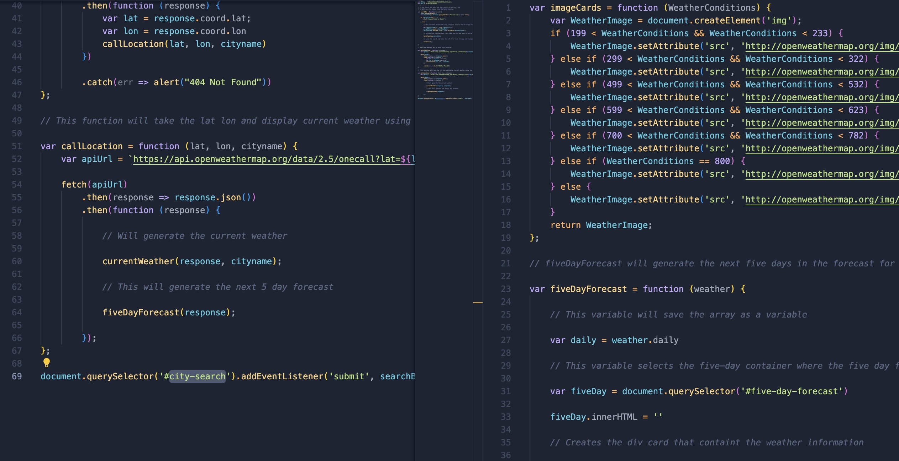
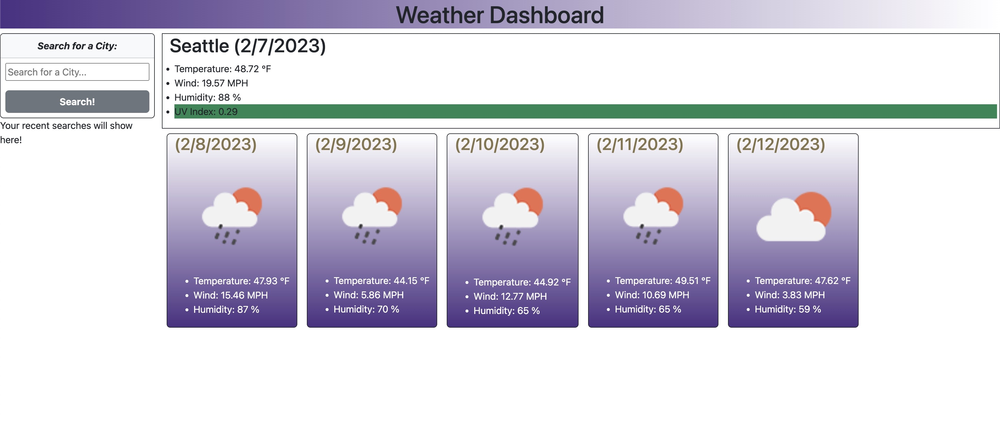

# Web API Quiz

 For this Project, I built a Weather Dashboard using Openweather's API. It was awesome reading through the documentation, and seeing it all come together. It was challenging getting the API key to work st the beginning, but once it started working it all came together like a puzzle. Feel free to check out the website to see weather in whichever city you choose!

# Website Link

https://goobber33.github.io/Crazy-Weather-We-re-Having/

# Installation

Install the index.html, JavaScript files, and style.css, and run it in your own IDE to run this repo. 

# Usage

 A screenshot of some sections of code from my JavaScript for this project. 

Screenshots of the website. The website should resemble this screenshot when deployed.

# Credits

This project was built from scratch by Kyle Parks

https://openweathermap.org/forecast5 

Above is the link to the documentation I used for this API